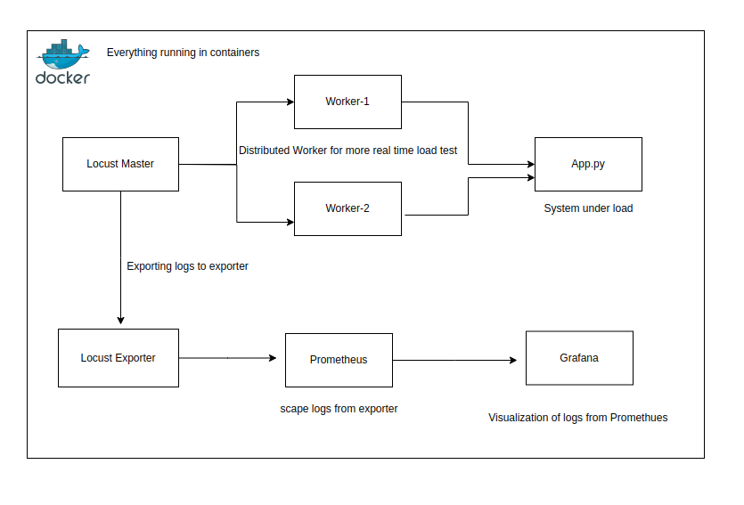

# Distributed Load Testing + Grafana + Docker

A streamlined setup for running Locust and monitoring performance metrics with Grafana and Prometheus in Docker containers. Easily visualize your load testing results with a pre-configured dashboard.

## Distrubuted Load Testing Architecture




## Features
- **Distributed Load Testing**: Run Locust in a distributed mode with multiple worker nodes.
- **Pre-configured Monitoring**: Grafana with Custom Dasboard baked in it and Prometheus are set up to monitor and visualize the performance metrics of your load tests.
- **Mock API**: Includes a mock API for testing purposes, which can be replaced by your own API.
- **User Load Testing**: Add N number of users to your API to test the response of your API

## Prerequisites
- Docker
- Docker Compose
- API Files 

## Getting Started

1. **Clone the Repository**:
    ```sh
    git clone https://github.com/yourusername/locust-grafana-docker.git
    cd locust-grafana-docker
    ```

2. **Replace the Mock API and IP Address**:
    - The mock API used in this setup can be replaced by your own API. Ensure your API follows the proper format and update the `load_tests.py` file accordingly.
    - Replace the `localhosts` in the prometheus.yml with the ip adress of docker container to scrape logs from locust-expoter
    - Replace the password and username for the grafana dasboard


3. **Start the Services**:
    - Run the following command to start Locust, Grafana, and Prometheus:
      ```sh
      docker-compose up -d
      ```

4. **Access Locust Web Interface**:
    - Open your browser and navigate to `http://IP_ADDRESS:8089` to access the Locust web interface.

5. **Access Grafana Dashboard**:
    - Open your browser and navigate to `http://IP_ADDRESS:3000` to access the Grafana dashboard.
    - Default Grafana login credentials:
      - **Username**: `admin`
      - **Password**: `admin`
  
6. **Adding the Grafana Dashboard**:
   - Add the `grafana_dashboard.json`file in the import section of the grafana dashbaord
   - Add the `Data Source` as `Prometheus` and make sure to add the Promethues URL and `save & test`

## Docker Compose Configuration

### Locust Worker Service

- **Adding Worker Nodes**:

```yaml
worker:
  image: locustio/locust
  volumes:
    - ./load_tests.py:/mnt/locust/load_tests.py
  command: -f /mnt/locust/load_tests.py --worker --master-host locust
  deploy:
   replicas: 1 ### Change the replicas to add more worker
```

- **Prometheus and Grafana Services**:
  - The configuration for Prometheus and Grafana services can be added as required.

- **Customizing Load Tests**:
  - Modify the `load_tests.py` file to define your load testing scenarios. Refer to the [Locust documentation](https://docs.locust.io/en/stable/) for more details.

- **Monitoring and Visualization**:
  - Prometheus is configured to scrape metrics from Locust, and Grafana is set up to visualize these metrics.
  - The default Grafana dashboard is pre-configured to display essential metrics such as request rates, response times, and failure rates.

- **Contributing**
  - Contributions are welcome! Please open an issue or submit a pull request for any enhancements or bug fixes.
  - Create a Folk of the project or can create a feature Branch 
  
- **License**
  - This project is licensed under the MIT License. See the `LICENSE` file for details.